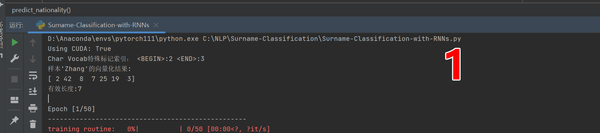
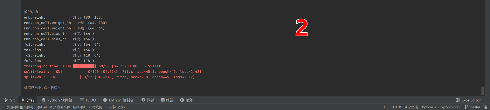
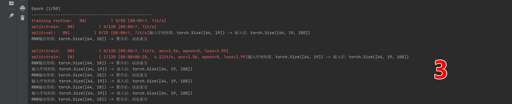
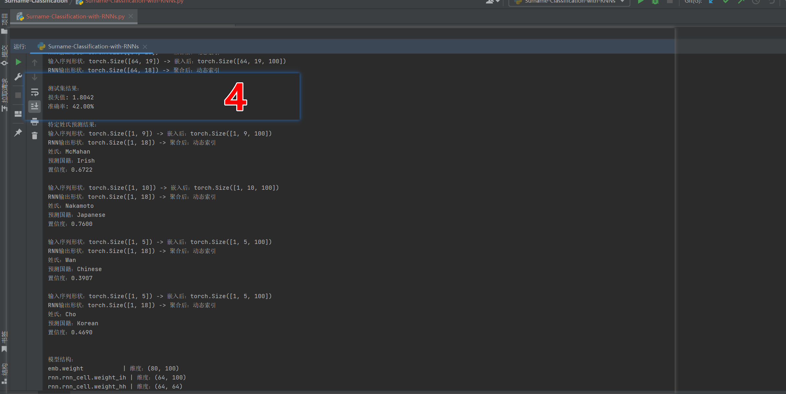
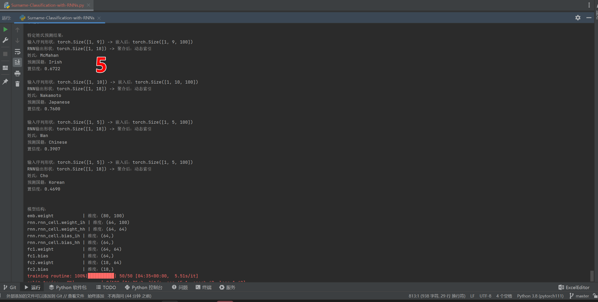
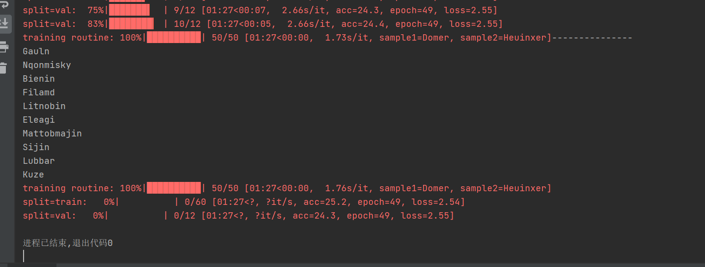
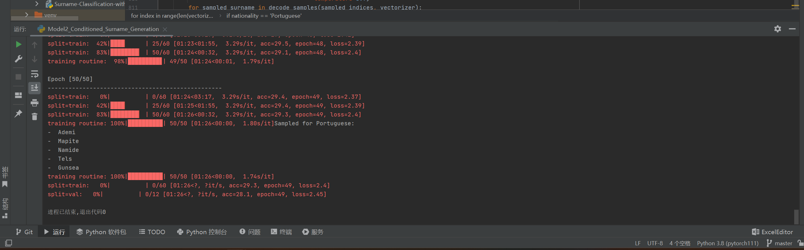

#
09RNN对应程序运行结果截图
##
数据处理验证

##
模型结构验证

##
rnn序列处理

##
模型性能评估

##
推理能力验证

#
10RNN

##
无条件姓氏生成

##
有条件姓氏生成

##
回答问题
###
1.  B.是否考虑国家信息作为生成条件
2.  B.作为GRU的初始隐藏状态
3.  B.将国家标签转换为隐藏状态初始化向量
4.  B.nationalities

